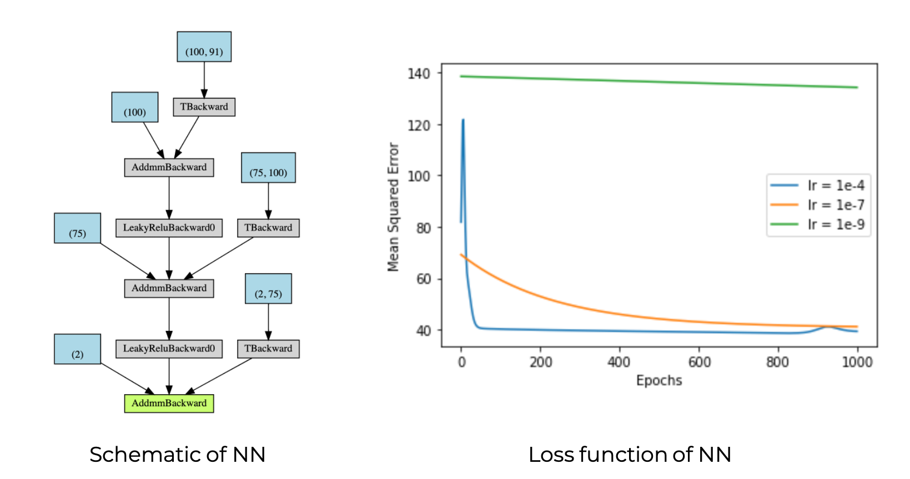

# Krátos Batteries 
[](https://travis-ci.org/kratos-batteries/kratos-batteries)
[](https://kratos-batteries.readthedocs.io/en/latest/?badge=latest)
[](https://coveralls.io/github/kratos-batteries/kratos-batteries?branch=master)
[](https://pypi.python.org/pypi/ansicolortags/)
[](http://hits.dwyl.com/kratos-batteries/kratos-batteries)
## Package for Predicting Battery Parameters of New Electrode Materials
This package can be used to predict the change in volume as well as the volumetric and gravimetric capacities of new electrode materials. To do so, this package extracts the entirety of the materials project (https://materialsproject.org/) database of electrode materials and with some data manipulation is able to create a Neural Network (NN). This NN is trained to help predict the aforementioned properties of new battery materials.

### Installation
```

```
### Software Dependencies
- Python 3 (>=3.5)
  - See environment.yml for environment
Notebooks are provided in the `Examples` directory. You will require a `jupyter notebook`. 
## Organization of Repository
```
Examples/
  BatteryData.csv
  CrystalSystemsTable.csv
  NewTraingingData_MinMaxScalar.csv
  NewTraingingData_StandardScalar.csv
  README.md
  data_extract.py
  example_runtrhough.ipynb
  feature_process_SVR.ipynb
  generate_inputs.py
  Integrating PCA.ipynb
  magpie.py
  nn.py
  PCA.ipynb
  SecondPassNN.ipynb
  svr_script.ipynb
  Userdata.ipynb
doc/
  Design/
    Flow-Charts.pdf
    usecases.md
  _build/
    doctrees/
      environment.pickle
      index.doctree
    html/
      _sources/
        index.rst.txt
      _static/
        alabaster.css
        basic.css
        custom.css
        doctools.js
        documentation_options.js
        file.png
        jquery-3.4.1.js
        jquery.js
        language_data.js
        minus.png
        plus.png
        pygments.css
        searchtools.js
        underscore-1.3.1.js
        underscore.js
      .buildinfo
      genindex.html
      index.html
      objects.inv
      py-modindex.html
      search.html
      searchindex.js
  Makefile
  conf.py
  index.rst
  make.bat
images/
  All_NN.png
  All_SVR.png
  NN_lossfunction.png
  NeuralNetworkFlow.png
  SVR_CV.png
  SVR_GC.png
  SVR.MDV.png
  logo.png
kratosbat/
  Data/
    DataForSVR/
      GC_PCA.csv
      GC_data.csv
      MDV_PCA.csv
      MDV_data.csv
      VC_PCA.csv
      VC_data.csv
    BatteryData.csv
    CrystalSystemsTable.csv
    ElementalProperty.csv
    NEWTrainingData_MinMaxScaler.csv
    NEWTrainingData_StandardScaler.csv
    TrainingData.csv
  DataProcess/
    PCA.py
    magpie.py
    userdata.py
    variable_selection_extraction.py
  ExtractMethod
    data_extract.py
  NN/
    NEWTrainingData_MinMaxScaler.csv
    NEWTrainingData_StandardScaler.csv
    generate_inputs.py
    magpie.py
    nn.py
  SVR/
    cross_validation.py
    svr_CV.pkl
    svr_GC.pkl
    svr_MDV.pkl
    svr_model.py
  ThirdPartyResource/
    magpie.py
  tests/
    README.md
    test_cross_validation
    test_nn.py
    test_svr_model.py
    test_variable_selection_extraction
  __init__.py
  __main__.py
  predict_tools.py
paper/
  Elemental Properties.pdf
  Machine Learning the Voltage of Electrode Materials.pdf
  Ward,Magpie.pdf
  supplement22.pdf
.coveragerc
.gitignore
.travis.yml
LICENSE
README.md
environment.yml
setup.py
```

## Data Extract & Process
In Kratos battery, Our training data were extracted from the Material Project database containing a total of 4400 data for intercalation-based electrode materials. 23,24 We utilized the Material Project?s application programming interface pymatgen to access the data from the database.  Although DFT predictions are not the gold standard for theoretical calculations in some contexts, 28 they do provide reasonable insights and can be used to guide experimental research.

The features used to specify a particular electrode material in our ML models include the working ion in the battery (i.e., Li or other metals), the concentration of the active metal ion in a given compound, crystal lattice types, and space group numbers. All other features were obtained from the elemental properties of the atomic constituents involved in a particular electrode. The elemental properties added to the feature vectors are adopted from the project called Magpie of Ward et al.

Finally, as Data processing, sklearn.feature_selection.RFE and sklearn.decomposition.PCA were applied to select and extract features, which can decrese dimensionality of training data from 241 to 135.


## Neural Network - PyTorch
Using Pytorch, a neural network  was created to predict gravimetric capacity, volumetric capacity, and max volume change for battery electrodes. The network was created through a sequential model, with two hidden layers. The model was then put through 1000 epochs to reduce mean squared error before a final model was produced to predict the desired properties.

<p align="center">
 
</p>

This loss function and schematic of this NN is shown above for user validation.

## Support Vector Machine - Regression (SVR)
We compared the performance of NN with another machine-learning model, SVM. When used for a regression problem, SVM is known as a support vector regression (SVR). SVR is a kernel-based regression technique known for its robust performance in complex data representations. It works by mapping nonlinearly separable datainreal space to higher dimensional space via a kernel function. We have used the radial basis function (RBF) kernel for this work. In addition, SVR depends on two important parameters (C and ?) that control the quality of the result. These parameters were tuned by using the grid search algorithm of sklearn. We varied C and ? logarithmically in between each $$10{-5}$ and $$ 10{5} $$ . For each of the possible combinations of C and ?, SVR computations were performed using 10-fold cross-validation to calculate the MSE.

<p align="center">
 
</p>

## Usage


## Other components of README
